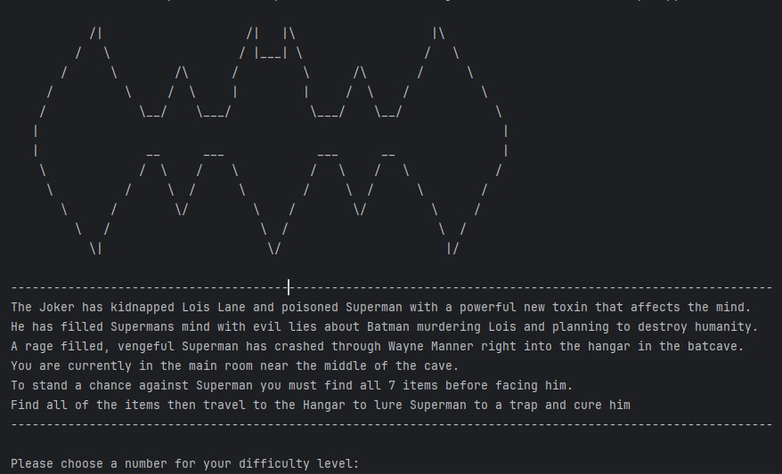
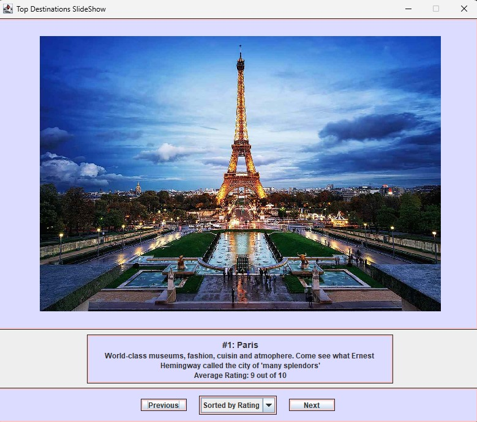
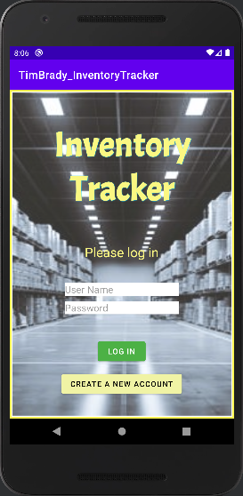

  <kbd></kbd>

## 
 Computer Science Capstone 

### 
 Code Review 

A code review is a methodical way of checking code for completeness and quality before it is used. This is important because it addresses many common issues that could arise in coding. These issues could include missed requirements, security vulnerabilities, bugs, or general coding best practices that may have been missed. 

A code review was conducted for each of the following three projects before they underwent enhancement. Please feel free to watch it by following the link below.

<code> <a href="https://youtu.be/f0aFHuVSD4M">Code Review</a> </code>

### 
 Project One: Software Engineering and Design 

The first project that was chosen for enhancement was a project developed for IT140 (Intro to Scripting) near the beginning of the pursuit of my degree three years ago. The text-based game that I created, called Batman: Cave of Injustice, was developed using the Python coding language and the PyCharm IDE. Players must navigate through various rooms to collect all of Batman's gadgets before facing the final boss (Superman), who has been filled with anger after being exposed to a toxin developed by The Joker.

<kbd></kbd>

This project is important to me and was chosen as an inclusion in my portfolio because it shows my progress over the last three years. The enhancements made to it are meant to showcase my ability to organize, modularize, and develop in a way that promotes maintainability and collaboration. The implementation of data structures like dictionaries and arrays allowed the code to be cleaned up and simplified significantly. This meets the following course outcomes:

- Employ strategies for building collaborative environments that enable diverse audiences to support organizational decision-making in the field of computer science.

- Design and evaluate computing solutions that solve a given problem using algorithmic principles and computer science practices and standards appropriate to its solution while managing the trade-offs involved in design choices.

Please feel free to follow the links below for more information on this project.

<code> <a href="https://github.com/Tbrady9/Tbrady9.github.io/tree/Batman-Cave-of-Injustice">Project Report and Instructions</a> </code> 

<code> <a href="https://github.com/Tbrady9/Tbrady9.github.io/tree/Batman-Cave-of-Injustice/Batman%20Cave%20of%20Injustice/Batman%20Cave%20Of%20Justice">Original Project Files (2021)</a> </code>

<code> <a href="https://github.com/Tbrady9/Tbrady9.github.io/tree/Batman-Cave-of-Injustice/Batman%20Cave%20of%20Injustice/Batman%20Cave%20of%20Injustice%20Enhanced">Enhanced Project Files (2024)</a> </code>

### 
 Project Two: Algorithms and Data Structures 

Project two is an assignment from my second year pursuing my computer science degree. In CS250 (Software Development Lifecycle), we were tasked with creating a slide show using the Java coding language and the Eclipse IDE. This slide show needed to have five slides, each with their own text description and picture. Snippets of the code were provided for us and we had to fill in the blanks to create the working slide show.

<kbd></kbd>

I chose to include this project because it shows off more of my creative side while also showing technical ability. To fit the algorithms and data structures theme of project two, I chose to incoporate a data structure to hold the destinations and implement a sorting method to allow the user to re-sort the destination data, and thus the slides, at any time. By implementing a destination class and creating an array of objects, I was able to use an action listener on a dropdown box on the slide show to re-sort the array and re-load the slide show each time an option in the dropdown box was chosen. I also chose to enhance the visuals of the slide show to make the user experience more enjoyable. The skills showcased within this project adhere to the following course outcomes:

- Demonstrate an ability to use well-founded and innovative techniques, skills, and tools in computing practices for the purpose of implementing computer solutions that deliver value and accomplish industry-specific goals.

- Design, develop, and deliver professional-quality oral, written, and visual communications that are coherent, technically sound, and appropriately adapted to specific audiences and contexts.

- Design and evaluate computing solutions that solve a given problem using algorithmic principles and computer science practices and standards appropriate to its solution while managing the trade-offs involved in design choices.

Please feel free to follow the links below for more information on this project.

<code> <a href="https://github.com/Tbrady9/Tbrady9.github.io/tree/Slideshow">Project Report and Instructions</a> </code>

<code> <a href="https://github.com/Tbrady9/Tbrady9.github.io/tree/Slideshow/Slide%20Show">Original Project Files (2022)</a> </code>

<code> <a href="https://github.com/Tbrady9/Tbrady9.github.io/tree/Slideshow/Slide%20Show%20Enhanced">Enhanced Project Files (2024)</a> </code>

### 
 Project Three: Databases 

The third project chosen for enhancement was a mobile app developed a year ago, in 2023, as part of my CS360 (Mobile Architect and Programming) course. The original task for this project was to develop a mobile android application for tracking inventory using the Java coding language, the Android Studio IDE, and an SQLite database. The requirements for the project were as follows:

- The app must have multiple screens
- The app must have a login and registration process
- The app must store and display inventory data
- The app must have a notification system

<kbd></kbd>

### 
 Professional Self Assessment 

Please check back soon.